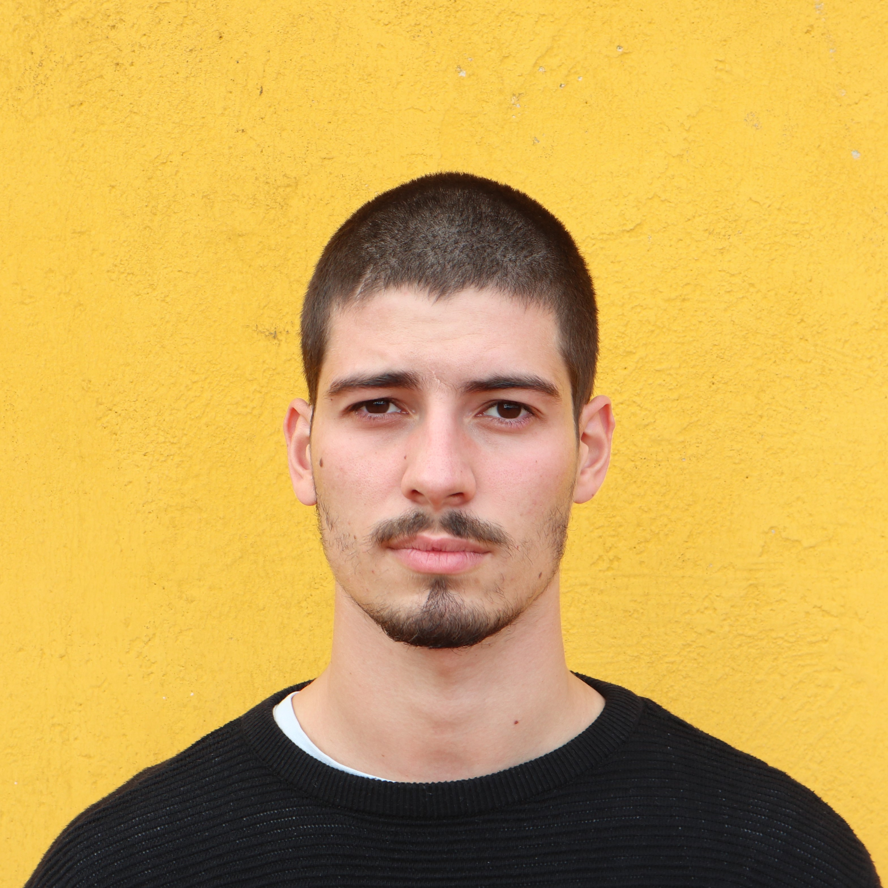
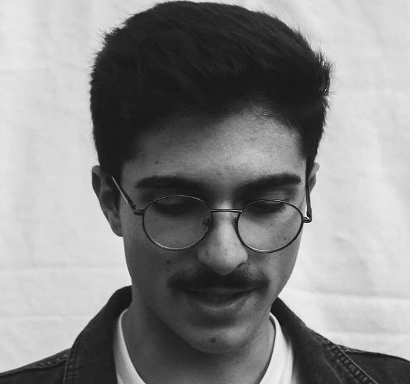

<title> 4Square </title>

    

# IPM - Group 6:

In the scope of the course of Human-Machine Interaction, we decided to create an app that promises revolucionize
the way that people organize their lives and works. And just like that, 4Square was born.

# The Team:

Ramiro Henriques, 52535

<a href="Assignent 1 - Ramiro.pdf">Assigment 1</a> 

António Pereira, 55416

<a href="Assignent 1 - final.jpg">Assigment 1</a> 

Duarte Belo, 55793

Diogo Lages, 55951

# Reports:

<a href="G_06_Stage1.pdf">Stage 1</a> 

<a href="G_06_Stage2.pdf">Stage 2</a> 

<a href="Stage3_P1_G6.pdf">Stage 3</a> 

<a href="flowmap.png"> - Storyboard (Attachment to Stage 3)</a> 

<a href="Stage4_P2_G6.pdf">Stage 4</a> 

<a href="Stage5_P2_G6.pdf">Stage 5</a> 

<a href="Stage6_P2_G6.pdf">Stage 6</a> 
